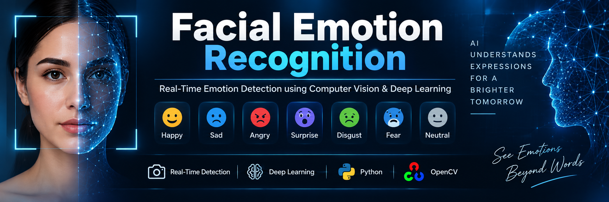

# 😊 Facial Emotion Recognition

<p align="center">
  
</p>

<h1 align="center">Facial Emotion Recognition</h1>

<p align="center">
  <b>Real-Time Computer Vision & Deep Learning Project</b>
</p>

<p align="center">
  Detect faces through a webcam and classify visible facial-expression patterns in real time using a Convolutional Neural Network (CNN).
</p>

---

## 📌 Project Overview

Facial Emotion Recognition is a **Computer Vision and Deep Learning** application that uses a laptop webcam to detect a human face and classify the visible facial-expression pattern into one of several predefined categories.

The system processes the webcam video frame by frame.

For every frame:

1. The camera captures an image.
2. The face is detected.
3. The detected face is extracted.
4. The face image is converted into grayscale.
5. The image is resized to `48 × 48` pixels.
6. Pixel values are normalized.
7. The processed image is given to the trained CNN model.
8. The model produces prediction scores for 7 expression categories.
9. The category with the highest prediction score is selected.
10. The detected expression and confidence score are displayed on the webcam screen.

The complete process happens in real time.

> **Important:** This project recognizes visible facial-expression patterns. It should not be interpreted as a system that can determine a person's true internal emotional state.

---

# 🎯 Problem Statement

Human-computer interaction can become more natural when computers are able to understand visual signals from people.

One such signal is facial expression.

However, manually analyzing facial expressions from video is difficult and cannot be performed efficiently in real time.

This project addresses the problem by developing a system that can:

- Access a webcam.
- Detect a human face.
- Extract the facial region.
- Process the facial image.
- Use a deep learning model for classification.
- Display the predicted facial-expression category in real time.

---

# 🎯 Project Objectives

The main objectives of this project are:

- Build a real-time computer vision application.
- Detect faces using OpenCV.
- Process facial images automatically.
- Use a pretrained CNN model for expression classification.
- Perform real-time prediction using a webcam.
- Display prediction results directly on the video.
- Understand the complete Computer Vision + Deep Learning pipeline.
- Demonstrate how CNN-based image classification can be integrated with OpenCV.

---

# ⭐ Key Features

- 🎥 Real-time webcam input
- 🙂 Automatic face detection
- 🧠 CNN-based facial-expression classification
- 🖼️ Image preprocessing
- ⚡ Real-time prediction
- 📊 Prediction confidence score
- 🟩 Face detection rectangle
- 💻 Runs locally on a computer
- 🔒 No cloud-based camera processing required by this application
- 🐍 Python-based implementation
- 🧩 Simple and understandable project architecture

---

# 😃 Supported Expression Categories

The model produces predictions for **7 output categories**:

| No. | Expression |
|---:|---|
| 1 | Angry |
| 2 | Disgust |
| 3 | Fear |
| 4 | Happy |
| 5 | Sad |
| 6 | Surprise |
| 7 | Neutral |

The model selects the class with the highest prediction score.

---

# ⚙️ How It Works

The application combines **Computer Vision**, **Image Processing**, and **Deep Learning**.

The high-level workflow is:

```text
Webcam
   ↓
Video Frame Capture
   ↓
Grayscale Conversion
   ↓
Face Detection
   ↓
Face Extraction
   ↓
Resize to 48 × 48
   ↓
Pixel Normalization
   ↓
CNN Model
   ↓
7-Class Prediction
   ↓
Highest Probability Class
   ↓
Emotion/Expression + Confidence
   ↓
Display on Webcam
```

---

# 🔄 Complete Process Pipeline

## Step 1 — Start the Camera

The application uses OpenCV to access the laptop's built-in webcam.

```python
camera = cv2.VideoCapture(0)
```

The value `0` normally represents the default camera.

The program continuously captures frames while the application is running.

---

## Step 2 — Capture a Video Frame

Each camera frame is read using:

```python
ret, frame = camera.read()
```

The frame contains the current image captured by the webcam.

The program checks whether the frame was successfully captured before continuing.

---

## Step 3 — Convert the Frame to Grayscale

The original webcam frame is converted from BGR color format to grayscale.

```python
gray = cv2.cvtColor(frame, cv2.COLOR_BGR2GRAY)
```

Instead of processing three color channels, the system works with a single intensity channel.

This reduces the amount of image information that needs to be processed.

---

## Step 4 — Detect the Face

OpenCV's Haar Cascade face detector is used to locate faces.

```python
faces = face_cascade.detectMultiScale(
    gray,
    scaleFactor=1.3,
    minNeighbors=5,
    minSize=(30, 30)
)
```

The detector returns the coordinates of detected faces.

Each face is represented using:

```text
x
y
width
height
```

---

## Step 5 — Extract the Face Region

After detecting a face, only the facial region is extracted from the frame.

```python
face = gray[y:y+h, x:x+w]
```

This is important because the CNN should focus on the face rather than the entire background.

---

## Step 6 — Resize the Face

The extracted face is resized to the input size expected by the model.

```python
face = cv2.resize(face, (48, 48))
```

The CNN model expects an image of:

```text
48 × 48 pixels
```

---

## Step 7 — Normalize Pixel Values

The pixel values are converted to floating-point numbers and normalized.

```python
face = face.astype("float32") / 255.0
```

Original pixel values normally range from:

```text
0 to 255
```

After normalization:

```text
0.0 to 1.0
```

This makes the input suitable for the neural network.

---

## Step 8 — Prepare the Tensor

The processed image is reshaped so that it matches the model's expected input dimensions.

```python
face = np.expand_dims(face, axis=0)
face = np.expand_dims(face, axis=-1)
```

The final input shape becomes:

```text
1 × 48 × 48 × 1
```

Where:

- `1` = batch size
- `48` = image height
- `48` = image width
- `1` = grayscale channel

---

## Step 9 — CNN Prediction

The processed facial image is passed to the trained model.

```python
prediction = model.predict(face, verbose=0)
```

The CNN produces prediction scores for the seven expression categories.

The model output shape is:

```text
(None, 7)
```

The `7` represents the seven output classes.

---

## Step 10 — Select the Highest Prediction

The system finds the class with the highest prediction score.

```python
emotion_index = np.argmax(prediction[0])
```

The corresponding label is selected from:

```python
emotion_labels = [
    "Angry",
    "Disgust",
    "Fear",
    "Happy",
    "Sad",
    "Surprise",
    "Neutral"
]
```

---

## Step 11 — Calculate Confidence

The prediction score is converted into a percentage for display.

```python
confidence = float(prediction[0][emotion_index]) * 100
```

For example:

```text
Happy (92.4%)
```

The displayed percentage represents the model's prediction score for the selected class. It is **not a guaranteed measure of actual emotional certainty**.

---

## Step 12 — Display the Result

OpenCV draws a rectangle around the detected face.

```python
cv2.rectangle(...)
```

The predicted expression is displayed above the rectangle.

Example:

```text
+-----------------------+
| Happy (92.4%)         |
|                       |
|       FACE            |
|                       |
+-----------------------+
```

---

# 🧠 Project Workflow

The complete project workflow can be summarized as:

```text
                 ┌──────────────────┐
                 │     Webcam       │
                 └────────┬─────────┘
                          ↓
                 ┌──────────────────┐
                 │  Capture Frame   │
                 └────────┬─────────┘
                          ↓
                 ┌──────────────────┐
                 │ Grayscale Image  │
                 └────────┬─────────┘
                          ↓
                 ┌──────────────────┐
                 │  Face Detection  │
                 └────────┬─────────┘
                          ↓
                 ┌──────────────────┐
                 │ Extract Face ROI │
                 └────────┬─────────┘
                          ↓
                 ┌──────────────────┐
                 │ Resize 48 × 48   │
                 └────────┬─────────┘
                          ↓
                 ┌──────────────────┐
                 │ Normalize Pixels │
                 └────────┬─────────┘
                          ↓
                 ┌──────────────────┐
                 │   CNN Model      │
                 └────────┬─────────┘
                          ↓
                 ┌──────────────────┐
                 │ 7-Class Output   │
                 └────────┬─────────┘
                          ↓
                 ┌──────────────────┐
                 │ Highest Score    │
                 └────────┬─────────┘
                          ↓
                 ┌──────────────────┐
                 │ Display Result   │
                 └──────────────────┘
```

---

# 🧩 What Is the "Prompt" / Project Instruction?

This project does not use a natural-language AI prompt to make the facial-expression prediction.

Instead, the **program itself provides the instructions and processing pipeline**.

The application's logical instruction can be described as:

```text
Capture webcam frame
→ detect face
→ extract face
→ convert to grayscale
→ resize to 48×48
→ normalize pixel values
→ send image to CNN
→ obtain seven prediction scores
→ select highest score
→ display expression and confidence
```

The CNN model does not receive a text prompt such as:

```text
"What emotion is this person feeling?"
```

Instead, it receives a numerical image tensor:

```text
1 × 48 × 48 × 1
```

and returns numerical prediction scores.

---

# 🛠️ Technologies Used

| Technology | Purpose |
|---|---|
| Python | Main programming language |
| OpenCV | Webcam, image processing and face detection |
| TensorFlow | Deep learning framework |
| Keras | Loading and running the CNN model |
| NumPy | Numerical and array operations |
| Haar Cascade | Face detection |
| CNN | Facial-expression classification |
| Git | Version control |
| GitHub | Source-code hosting |

---

# 📚 Libraries and Their Roles

## 🐍 Python

Python is the main programming language used to build the application.

It connects the camera, image-processing operations and deep learning model.

---

## 👁️ OpenCV

OpenCV is used for:

- Webcam access
- Video frame capture
- Color conversion
- Grayscale conversion
- Face detection
- Image resizing
- Drawing rectangles
- Displaying the live video
- Displaying prediction text

Main import:

```python
import cv2
```

---

## 🔢 NumPy

NumPy is used to manipulate image arrays and prepare the input tensor.

Main import:

```python
import numpy as np
```

It is used for:

- Data conversion
- Normalization
- Array reshaping
- Adding batch dimensions
- Finding the highest prediction

---

## 🧠 TensorFlow

TensorFlow provides the deep learning framework required to load and execute the trained CNN.

Main import:

```python
import tensorflow as tf
```

TensorFlow performs the neural-network inference.

---

## 🧠 Keras

Keras is used through TensorFlow to load the pretrained model.

```python
model = tf.keras.models.load_model(
    "models/emotion_model.h5",
    compile=False
)
```

---

# 🧠 Model Information

The project uses a pretrained CNN model:

```text
emotion_model.h5
```

Location:

```text
models/emotion_model.h5
```

The model is stored in HDF5 format.

---

## Model Input

The verified model input shape is:

```text
(None, 48, 48, 1)
```

This means the model expects:

```text
Height  = 48
Width   = 48
Channels = 1
```

The single channel represents grayscale input.

---

## Model Output

The verified model output shape is:

```text
(None, 7)
```

The model therefore produces seven output scores.

The application maps those outputs to:

```text
Angry
Disgust
Fear
Happy
Sad
Surprise
Neutral
```

---

## Model Inference

During real-time operation:

```text
48 × 48 grayscale face
          ↓
       CNN Model
          ↓
   Seven prediction scores
          ↓
   Highest score selected
          ↓
  Expression displayed
```

---

# 🖼️ Image Processing

Image processing is one of the most important parts of the project.

The application does not send the complete webcam frame directly into the CNN.

Instead, the frame passes through multiple preprocessing stages.

## Image Processing Pipeline

```text
Original Webcam Frame
        ↓
Grayscale Conversion
        ↓
Face Detection
        ↓
Face Cropping
        ↓
Resize to 48 × 48
        ↓
Convert to Float32
        ↓
Normalize /255
        ↓
Add Batch Dimension
        ↓
Add Channel Dimension
        ↓
CNN Input
```

---

# 🔍 Why Grayscale?

The facial-expression model expects a single-channel image.

Converting the frame to grayscale:

- Reduces data size.
- Removes unnecessary color information.
- Matches the model input format.
- Simplifies preprocessing.

---

# 📐 Why 48 × 48?

The pretrained model expects facial images with a spatial resolution of:

```text
48 × 48 pixels
```

Therefore every detected face is resized before being sent to the CNN.

---

# 📊 Why Normalize the Image?

Raw grayscale pixels range from:

```text
0 → 255
```

The project converts them to:

```text
0.0 → 1.0
```

using:

```python
face = face.astype("float32") / 255.0
```

This provides an appropriate numerical scale for model inference.

---

# 🗂️ Project Structure

The project is organized as follows:

```text
EmotionRecognition/
│
├── models/
│   └── emotion_model.h5
│
├── assets/
│   └── banner.png
│
├── screenshots/
│   ├── happy.png
│   ├── angry.png
│   ├── sad.png
│   └── application.png
│
├── camera_test.py
├── face_dectection.py
├── emotion_detection.py
├── .gitignore
└── README.md
```

> If your repository does not yet contain the `screenshots/` folder, create it when adding your demonstration screenshots.

---

# 📄 File Descriptions

| File | Description |
|---|---|
| `emotion_detection.py` | Main real-time facial-expression recognition application |
| `camera_test.py` | Tests whether the webcam works correctly |
| `face_dectection.py` | Tests face detection using OpenCV |
| `models/emotion_model.h5` | Pretrained CNN model |
| `assets/banner.png` | GitHub README project banner |
| `.gitignore` | Prevents unnecessary files from being committed |
| `README.md` | Project documentation |

---

# 💻 Installation

## 1. Clone the Repository

```bash
git clone https://github.com/madheshw265-lang/EmotionRecognition.git
```

Move into the project directory:

```bash
cd EmotionRecognition
```

---

# 🐍 2. Create a Virtual Environment

Create a virtual environment:

```bash
python -m venv venv
```

---

# ▶️ 3. Activate the Virtual Environment

On Windows:

```bash
venv\Scripts\activate
```

After activation, the terminal should show something similar to:

```text
(venv)
```

---

# 📦 4. Install Required Libraries

Install the required packages:

```bash
pip install opencv-python==4.10.0.84 numpy tensorflow
```

The main environment used during development includes:

```text
Python 3.12.10
OpenCV 4.10.0.84
NumPy 2.5.3
TensorFlow 2.21.0
Keras 3.15.1
```

---

# 🧪 5. Verify TensorFlow and Model

Run:

```bash
python -c "import tensorflow as tf; model=tf.keras.models.load_model('models/emotion_model.h5', compile=False); print('MODEL LOADED SUCCESSFULLY'); print('Input:', model.input_shape); print('Output:', model.output_shape)"
```

Expected result:

```text
MODEL LOADED SUCCESSFULLY
Input: (None, 48, 48, 1)
Output: (None, 7)
```

---

# 📷 Running the Application

## Step 1 — Test the Camera

Run:

```bash
python camera_test.py
```

This checks whether the laptop webcam can be accessed successfully.

---

## Step 2 — Test Face Detection

Run:

```bash
python face_dectection.py
```

The program should open the webcam and detect a face using a rectangle.

---

## Step 3 — Run Facial Emotion Recognition

Run:

```bash
python emotion_detection.py
```

The application should open the webcam.

When a face is detected, the system will display something similar to:

```text
Happy (92.4%)
```

---

# ⛔ Exit the Application

To stop the application:

```text
Press Q
```

The program will release the camera and close the OpenCV window.

---

# 🧪 Testing

The project can be tested in multiple stages.

## Test 1 — Camera Test

Purpose:

```text
Verify webcam access
```

Run:

```bash
python camera_test.py
```

Expected result:

```text
Live webcam window
```

---

## Test 2 — Face Detection Test

Purpose:

```text
Verify that OpenCV can detect a face
```

Run:

```bash
python face_dectection.py
```

Expected result:

```text
Face rectangle appears around the detected face.
```

---

## Test 3 — Model Loading Test

Purpose:

```text
Verify that TensorFlow/Keras can load the model.
```

Expected:

```text
MODEL LOADED SUCCESSFULLY
Input: (None, 48, 48, 1)
Output: (None, 7)
```

---

## Test 4 — Real-Time Prediction

Purpose:

```text
Verify the complete pipeline.
```

Run:

```bash
python emotion_detection.py
```

Expected workflow:

```text
Camera
   ↓
Face detected
   ↓
Face processed
   ↓
CNN prediction
   ↓
Expression displayed
```

---

# 📸 Demo Screenshots

Add screenshots of the working application here.

Example:

```markdown
## Happy Expression


## Angry Expression


## Sad Expression


## Application


```

---

# 🎥 Demo Workflow

A typical demonstration can follow this sequence:

```text
1. Start the application
2. Webcam opens
3. User appears in front of camera
4. Face is detected
5. Face region is extracted
6. Facial image is preprocessed
7. CNN analyzes the image
8. Prediction is generated
9. Expression and score appear on screen
10. User changes facial expression
11. System updates the prediction
```

---

# 🧮 Prediction Logic

The model produces seven prediction values.

Conceptually:

```text
Angry     → prediction score
Disgust   → prediction score
Fear      → prediction score
Happy     → prediction score
Sad       → prediction score
Surprise  → prediction score
Neutral   → prediction score
```

The program selects the largest value.

For example:

```text
Angry     = 0.03
Disgust   = 0.01
Fear      = 0.05
Happy     = 0.91
Sad       = 0.02
Surprise  = 0.04
Neutral   = 0.01
```

The highest score is:

```text
Happy = 0.91
```

Therefore the application displays:

```text
Happy (91.0%)
```

---

# 🏗️ System Architecture

```text
┌───────────────────────┐
│      Laptop Camera    │
└───────────┬───────────┘
            ↓
┌───────────────────────┐
│      OpenCV Frame     │
│       Capture         │
└───────────┬───────────┘
            ↓
┌───────────────────────┐
│    Face Detection     │
│     Haar Cascade      │
└───────────┬───────────┘
            ↓
┌───────────────────────┐
│     Face Extraction   │
└───────────┬───────────┘
            ↓
┌───────────────────────┐
│  Grayscale + Resize   │
│       48 × 48         │
└───────────┬───────────┘
            ↓
┌───────────────────────┐
│   Pixel Normalization │
└───────────┬───────────┘
            ↓
┌───────────────────────┐
│       CNN Model       │
│    emotion_model.h5   │
└───────────┬───────────┘
            ↓
┌───────────────────────┐
│    7-Class Output     │
└───────────┬───────────┘
            ↓
┌───────────────────────┐
│ Highest Score + Label │
└───────────┬───────────┘
            ↓
┌───────────────────────┐
│  Result on Live Video │
└───────────────────────┘
```

---

# 🔐 Privacy

The application is designed to process the webcam stream locally.

The project does not contain functionality to upload captured webcam frames to a remote server.

However, users should always follow applicable privacy rules when recording or analyzing other people.

---

# ⚠️ Limitations

This project has several limitations:

- Lighting can affect predictions.
- Face angle can affect recognition.
- Occlusion such as masks or hands may reduce accuracy.
- Multiple faces may produce different prediction results.
- Facial expressions can be ambiguous.
- A prediction score is not a guaranteed measurement of a person's actual emotion.
- The pretrained model may not perform equally well for every person or environment.
- Real-time performance depends on the computer's hardware.

---

# 🚀 Future Enhancements

Possible future improvements include:

- Improve model accuracy.
- Train or fine-tune the CNN on a larger dataset.
- Add more robust face detection.
- Improve recognition under different lighting conditions.
- Support multiple faces.
- Display prediction probabilities for all seven classes.
- Add FPS monitoring.
- Add a graphical user interface.
- Add video-file input.
- Add optional image upload.
- Improve preprocessing.
- Add model evaluation metrics.
- Add confusion matrix and accuracy graphs.
- Optimize inference speed.
- Deploy as a web or desktop application.

---

# 🌍 Real-World Applications

Facial-expression recognition can be explored in areas such as:

- Human-computer interaction
- Educational technology
- User-experience research
- Interactive systems
- Entertainment applications
- Computer vision research
- Robotics
- Social interaction systems
- Accessibility research
- Academic demonstrations

These applications should use the technology responsibly and avoid treating facial-expression predictions as definitive evidence of a person's internal emotional state.

---

# 🎓 Learning Outcomes

This project demonstrates practical knowledge of:

- Python programming
- Computer Vision
- OpenCV
- Webcam integration
- Face detection
- Image preprocessing
- NumPy arrays
- TensorFlow
- Keras
- CNN inference
- Machine Learning classification
- Real-time AI applications
- Git
- GitHub
- Project documentation

---

# 🧰 Development Workflow

The project was developed using the following general workflow:

```text
Project Setup
      ↓
Python Environment
      ↓
Camera Testing
      ↓
Face Detection Testing
      ↓
Model Integration
      ↓
Image Preprocessing
      ↓
CNN Prediction
      ↓
Real-Time Display
      ↓
Testing
      ↓
Git Version Control
      ↓
GitHub Repository
```

---

# 📋 Project Summary

| Category | Details |
|---|---|
| Project Type | Computer Vision + Deep Learning |
| Language | Python |
| Framework | TensorFlow / Keras |
| Computer Vision | OpenCV |
| Numerical Processing | NumPy |
| Model Type | CNN |
| Model File | `emotion_model.h5` |
| Input Size | `48 × 48 × 1` |
| Output Classes | 7 |
| Input Source | Laptop Webcam |
| Processing | Real Time |
| Platform | Windows / Python |
| Repository | GitHub |

---

# 💡 Why This Project Is Useful

This project provides a practical demonstration of how an AI model can be connected to a real-world input device.

Instead of simply running a model on a static image, the project combines:

```text
Hardware
   +
Computer Vision
   +
Image Processing
   +
Deep Learning
   +
Real-Time Inference
   +
Visualization
```

This makes it a useful beginner-to-intermediate project for understanding the complete AI application pipeline.

---

# 🔬 Technical Pipeline Summary

The complete technical pipeline is:

```text
Camera
  ↓
Frame Acquisition
  ↓
BGR → Grayscale
  ↓
Haar Cascade Face Detection
  ↓
Face ROI Extraction
  ↓
Resize to 48 × 48
  ↓
Float32 Conversion
  ↓
Pixel Normalization
  ↓
Tensor Reshaping
  ↓
CNN Inference
  ↓
Seven Prediction Scores
  ↓
Argmax Classification
  ↓
Confidence Calculation
  ↓
OpenCV Visualization
```

---

# 📁 Repository

GitHub repository:

**EmotionRecognition**

Repository:

```text
https://github.com/madheshw265-lang/EmotionRecognition
```

---

# 👨‍💻 Author

## Madhesh G

**Computer Science / Technology Student**

Interested in:

- Artificial Intelligence
- Machine Learning
- Computer Vision
- Deep Learning
- Software Development
- Real-Time AI Applications

### GitHub

```text
https://github.com/madheshw265-lang
```

### Project Repository

```text
https://github.com/madheshw265-lang/EmotionRecognition
```

---

# 🤝 Contributions

Suggestions and improvements are welcome.

Possible contribution areas include:

- Model improvement
- Better preprocessing
- UI improvements
- Performance optimization
- Documentation
- Testing
- Additional computer vision features

---

# 📜 License

This project is provided for educational and demonstration purposes.

The project code and any third-party pretrained model may have different licensing terms. Before redistributing or using the model commercially, verify the applicable license and usage conditions of the original model source.

---

# ⚖️ Responsible AI Disclaimer

This project demonstrates facial-expression classification for educational and technical purposes.

The system predicts visual expression categories from facial images. It does **not** reliably determine a person's private thoughts, feelings, intentions, personality, or mental state.

Predictions may be affected by:

- Lighting
- Camera quality
- Facial pose
- Occlusion
- Individual differences
- Dataset limitations
- Model limitations

The results should therefore be treated as **AI-generated predictions rather than factual judgments about a person**.

---

# ⭐ Project Highlights

```text
✓ Real-Time Webcam Processing
✓ Face Detection
✓ Facial Image Preprocessing
✓ CNN-Based Classification
✓ 7 Expression Categories
✓ Confidence Score Display
✓ Local Processing
✓ Python Implementation
✓ OpenCV Integration
✓ TensorFlow/Keras Integration
✓ GitHub Project
```

---

# 🎯 Final Project Vision

The goal of this project is to demonstrate a complete real-time AI pipeline:

```text
REAL WORLD
    ↓
WEBCAM
    ↓
COMPUTER VISION
    ↓
IMAGE PROCESSING
    ↓
DEEP LEARNING
    ↓
CLASSIFICATION
    ↓
REAL-TIME RESULT
```

This project serves as a foundation for building more advanced **Computer Vision and Artificial Intelligence applications** in the future.

---

<p align="center">
  <b>Built with Python, OpenCV, TensorFlow and Keras ❤️</b>
</p>

<p align="center">
  Facial Emotion Recognition — Real-Time Computer Vision Project
</p>
